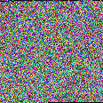

# to-img
convers any file into an abstract art piece which can be viewed

## example 
  
we got this image, and if we wanna compact the file it will turn into  
  
this:  
  
  
it still holds the same data but is compacted as closesly together possible

## how
it just packs all bytes of the file into RGB channels of the png, which is why images are so happily colored

# why
i was bored

# todo
* after conversion back to an file, the output file has tailing zeros
